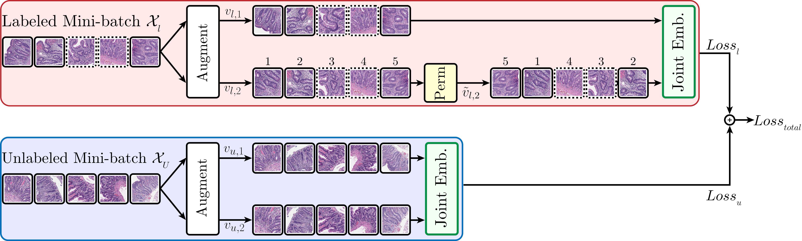

# HistoPerm
Official code for the paper [HistoPerm: A permutation-based view augmentation approach for improving histopathologic feature representation learning](https://doi.org/10.1016/j.jpi.2023.100320) appearing in the Elsevier Journal of Pathology Informatics.



# Requirements
+ [kornia](https://www.kornia.org/)
+ [pytorch-lightning](https://lightning.ai/docs/pytorch/stable/)
+ [scikit-learn](https://scikit-learn.org/)
+ [torch](https://pytorch.org/)
+ [torchvision](https://docs.pytorch.org/vision/stable/index.html)
+ [tqdm](https://tqdm.github.io/)

# Installing Dependencies (Recommended)
Run 
```commandline
pip install -r requirements.txt
```
to install all the required packages. Depending on your system configuration, you may need to install different versions to the ones we provide.

# Usage
The file `config.py` contains all the configurable options for the model. 
You can either change the options in this file (not recommended) or on the command line when running the model.

To run the model, use
```commandline
python run.py
```
and add any command line arguments as desired.

# To-do 
+ Remove old files that have been refactored (i.e., byol_model.py, ...)
+ Add documentation for both code and README
+ Re-organize code into sensible folders
+ Create python requirements file (add versions now)
+ Make this repo a python package (i.e., add a setup.py file for usage with other code)
+ Make HistoPerm module a new class so it can be imported elsewhere
+ Re-factor the model code to be cleaner. Shouldn't have different versions of each model for with or without HistoPerm.